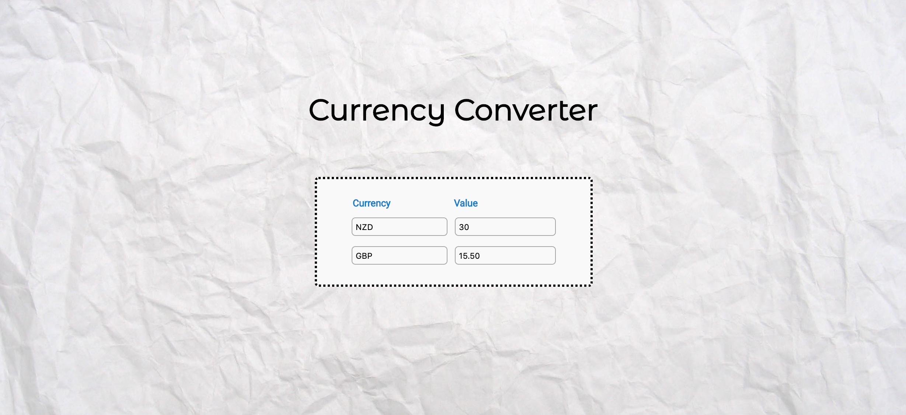

# Currency Converter
**Individual lab: JavaScript, Vue.js**

## The Project
The brief for this project was to create a web application that would convert a given value from Euros into any other currency selected using an [external API](https://api.exchangeratesapi.io/latest).

### Extension
The brief extension was to extend the capability of the app to convert a given value from _any_ selected currency into another selected currency.

The app has been designed so that the user is able to enter any value into either input field, and the value in the opposing input field will dynamically update according to the comparative exchange rate of each currency selected.

## Screen grab

 

## Installation Setup

``` bash
# install dependencies
npm install

# build for production with minification
npm run build

# open in the browser
open public/index.html
```
